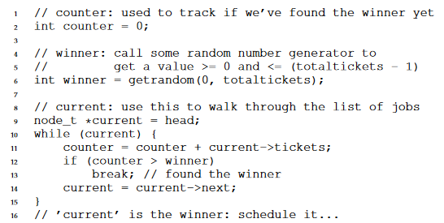
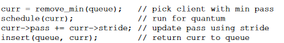
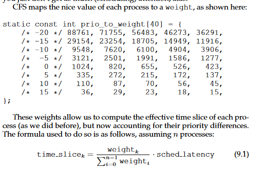
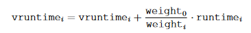
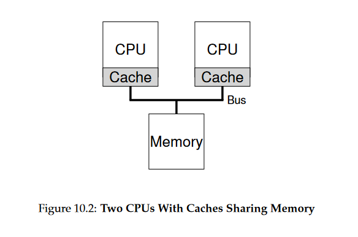
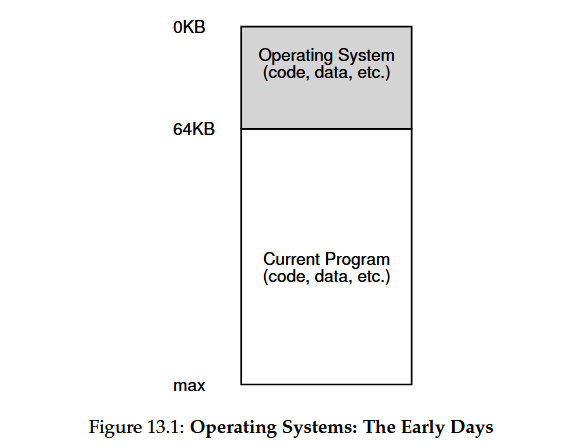
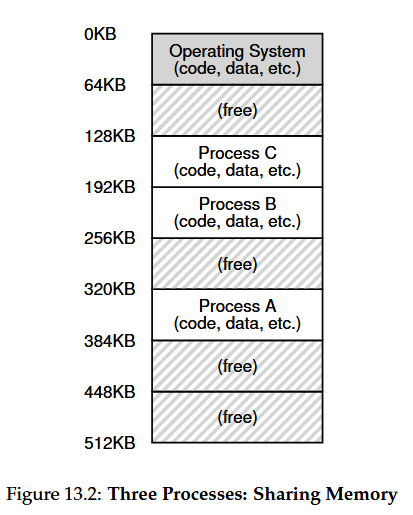
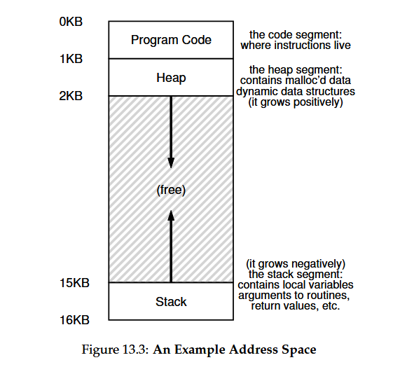

# Textbook Notes from OSTEP

## Table of Contents
1. [Chapter 4 - Processes](#chapter-4)
2. [Chapter 5 - Process API](#chapter-5)
3. [Chapter 6 - Direct Execution](#chapter-6)
4. [Chapter 7 - CPU Scheduling](#chapter-7)
5. [Chapter 8 - Multi-level Feedback](#chapter-8)
6. [Chapter 9 - Scheduling: Proportional Share](#chapter-9)
7. [Chapter 10 - Multiprocessor Scheduling](#chapter-10)
8. [Chapter 13 - The Abstraction: Address Spaces](#chapter-13)
9. [Chapter 14 - Interlude: Memory API](#chapter-14)
10. [Chapter 26 - Concurrency and Threads](#chapter-15)
11. [Chapter 27 - Thread API](#chapter-16)
12. 

## Chapter 4
- A process is simply a running program
  - It just sits there on the disk, a bunch of instructions waiting to spring into action
  - The OS takes these bytes and gets them running
- The OS creates the illusion of many CPUs (many CPUs allow you to run many many processes) by virtualizing the CPU
- Time sharing is a process used in virtualization where the CPU runs one process, then stops it, then runs another process, promoting the illusion that many virtual CPUs exist
- Mechanisms are low-level methods or protocols that implement a needed piece of functionality
- Context switching gives the OS the ability to stop running one program and start running another on a given CPU
- Policies are algorithms for making some kind of decision within the OS
  - For example, given a number of possible programs to run on a CPU, which program should the OS run?
    - A scheduling policy in the OS will make this decision
### The Abstraction: A Process
- The abstraction provided by the OS of a running program is something we call a process
- A machine state is what a program can read or update when it is running
  - For instance, one component of machine state is a process's memory
    - Instructions lie in memory
  - The memory that the process can address (called its address space) is part of the process
  - Registers are also a part of the machine state, many instructions explicitly read or update registers
    - Some special registers
      - Program Counter (PC) tells us which instruction of the process will execute next
      - Stack pointer and frame pointer are used to manage the stack for function parameters, local variables, and return addresses
### Process API
-  Here is what must be included in any interface of an OS
   -  Create: create new processes
   -  Destroy: destroy processes forcefully
   -  Wait: wait for a process to stop running
   -  Misc control: an example would be some method to suspend a process and then resume it
   -  Status: status information about a process, such as how long it has run for
### Process Creation: A Little More Detail
- The first thing an OS must do to run a program is to load its code and any static data into memory, into the address space of the process
  - Programs initially reside on disk in an executable format
  - In early OS, loading is done eagerly (all at once before running the program). In a modern OS the loading process is done lazily, by loading pieces of code or data only as they are needed during pgoram execution
- Some memory must be allocated for the program's run-time stack, which C programs use for local variables, function paramters, and return addresses
- The OS may also allocate some memory for the program's heap, which is used for requested dynamically-allocated data
- Finally, the main() function is called, and CPU control is transferred to the process
### Process States
- Running: a process is running on a processor (executing instructions)
- Ready: a process is ready to run but for some reason the OS has chosen not to run it at this given moment
- Blocked: a process has performed some kind of operation that makes it not ready to run until some other event takes place
- Being moved from ready to running means the process has been scheduled, vice versa means descheduled
### Data Structures
- The OS will likely keep some process list for all processes that are ready 
- The register context will hold for a stopped process the contents of its registers. Basically when the process starts running, those values will be put into the appropriate registers again

[Back to top](#table-of-contents)
## Chapter 5
### The ```fork()``` System Call
- ```fork()``` is used to create a new process

Let's examine the following code:
```C
#include <stdio.h>
#include <stdlib.h>
#include <unistd.h>

int main(int argc, char *argv[]) {
  printf("hello (pid:%d)\n", (int) getpid());
  int rc = fork();
  if (rc < 0) {
    // fork failed
    fprintf(stderr, "fork failed\n");
    exit(1);
  } else if (rc == 0) {
    // child (new process)
    printf("child (pid:%d)\n", (int) getpid());
  } else {
    // parent goes down this path (main)
    printf("parent of %d (pid:%d)\n", rc, (int) getpid());
  }
  return 0;
}
```

Running the program called p1.c will get the output:
```
prompt> ./p1
hello (pid:29146)
parent of 29147 (pid:29146)
child (pid:29146)
prompt>
```

Breakdown:

*Note: ```fork()``` will return the child's PID to the parent process, and 0 to the child process*

The process prints out a hello message, which includes its process identifier (PID). The PID (in UNIX systems) is used to name the process if one wants to do something with the process, such as to stop it from running

Then, the process calls ```fork()```, which the OS provides as a way to create a new process. The odd part is that the process that is created is an almost exact copy of the calling process. The OS sees two copies of the program *p1* running, and both are about to return from the ```fork()``` system call. The newly-created process does not start running at ```main()```, but instead just comes into life as if it had called ```fork()``` itself.

It is important to note that the child process will not have its own copy of the address space (its own private memory), its own registers, its own PC, and so forth. Also, the output is not deterministic. If you have a single CPU that houses both processes, it may choose to run either the parent or the child process first.

### The ```wait()``` System Call

```C
#include <stdio.h>
#include <stdlib.h>
#include <unistd.h>
#include <sys/wait.h>

int main(int argc, char *argv[]) {
  printf("hello (pid:%d)\n", (int) getpid());
  int rc = fork();
  if (rc < 0) {
    // fork failed
    fprintf(stderr, "fork failed\n");
    exit(1);
  } else if (rc == 0) {
    // child (new process)
    printf("child (pid:%d)\n", (int) getpid());
  } else {
    // parent goes down this path (main)
    int rc_wait = wait(NULL)
    printf("parent of %d (rc_wait:%d) (pid:%d)\n", rc, rc_wait, (int) getpid());
  }
  return 0;
}
```
Sometimes, it is usefu for a parent to wait for a child process to finish. This is accomplished with ```wait()```. 

In the above code, the parent process calls ```wait()``` to delay its execution until the child finishes executing. This makes the code deterministic (child process always completes before parent process).

### The ```exec()``` System Call
The ```exec()``` system call is useful when you want to run a program different from the calling program.

It loads code from the executable and overwrites its current code segment with it; the heap and stack and other parts of the memory space of the pgoram are re-initialized. Then, the OS simply runs that program. It does not create a new process, but transforms the currently running program into a different running program.

### Why? Motivating the API
The reason is because of the UNIX shell. When you enter a command into the shell, the shell will call ```fork()``` to create a new child process. That child process will call ```exec()``` to transform itself into the desired program. The shell will call ```wait()``` and wait until the process is finished, and then display the output.

For instance:

```
prompt> wc p3.c > newfile.txt
```

The output of the program wc is redirected into the output file *newfile.txt*. The way the shell accomplishes this task is quite simple, when the child is created, before calling ```exec()```, the shell closes standard output and opens the file *newfile.txt*. By doing so, any output from the soon-to-be-running program wc is sent to the file instead of the screen. 

[Back to top](#table-of-contents)

## Chapter 6

Remember, to virtualize the CPU, time sharing is used, where the CPU will run one process for a little while, then run another one, and so forth.

### Basic Technique: Limited Direct Execution
- Direct execution is simply running the program directly on the CPU.
  - Problem: if we just run the program, how can the OS make sure the program does not do anything we do not want it to? Also, when running a process, how does the OS stop it from running and switch to another process
### Problem #1: Restricted Operations
- To balance security with efficiency, a new processor mode, known as user mode is introduced. 
  - Code that runs in user mode is restricted in what it can do. It cannot issue I/O requests
- Kernel mode is what the OS runs in. Code can do what it likes in this mode, such as I/O requests.
- To allow user processes to perform a kind of privileged operation, system calls are introduced.
  - Allows the kernel to carefully expose certain key pieces of functionality to user programs
  - To execute a system call, a program uses a special trap instruction
    - Trap instruction jumps into the kernel and raises the privilege level to kernel mode
    - Program can now do any privileged operations (if allowed)
    - When finished, a return-from-trap instruction is returned into the user program and the privilege level is set back to user mode
- A trap table is used. Basically, trap handlers are locations of events that must take place for certain hardware events. These handlers are given a system call number, and the user program is responsible for putting those system call number in a register or at a specified location on the stack. If the number is valid, it executes the corresponding code. 
- Telling the hardware where the trap tables are is a privileged operation
### Problem #2: Switching Between Processes
- If a process is running on the CPU, but you want to switch to another process, the OS cannot switch the process as the OS *is not running when the CPU is running a process*.

How do we solve this?
- One solution is the cooperative approach. The OS trusts the processes of the system to behave reasonable. 
  - A process that runs too long are assumed to periodically give up the CPU so that the OS can decide to run some other task
  - Porcesses transfer control of the CPU to the OS by making system calls. There is often an explicit *yield* command that does nothing but transfer control to the OS so it can run other processes
- Another approach is non-cooperative, where the OS takes control
  - A timer interrupt is run where every so many milliseconds, when the interrupt is raised, the currently running process is halted, and a pre-configured interrupt handler in the OS runs
- If a decision is made to switch to a different process, the OS executes a context switch
  - The OS saves a few register values for the currently-executing process (onto its kernel stack, for example) and restore a few for the soon to be executing 

## Table of Contents

## Chapter 7
- A **policy** simply determines when to schedule a process 
### Workload Assumptions
- Workload refers to the processes running in the system
  - Critical part of building policies
- Goal is to develop a fully-operational scheduling discipline
  - Following assumptions about the processes (jobs):
    1. Each job runs for the same amount of time
    2. All jobs arrive at the same time
    3. Once started, each job runs to completion
    4. All jobs only use the CPU (i.e., they perform no I/O)
    5. The run-time of each job is known
### Scheduling Metrics
- A scheduling metric is something we use to _measure_ something, and there are a number of metrics that can make sense in the context of scheduling
- One metric is called **turnaround time**
  - Defined as the time at which the job completes minus the time at which the job arrived in the system
  - T_turnaround = T_completion - T_arrival
  - Since assumption says all jobs arrive at the same time, T_arrival = 0, meaning T_turnaround = T_completion (for now)
- Turnaround time is a performance metric
- Fairness is another metric, as measured by Jain's Fairness Index
- Fairness and performance are often at odds in schedling
### First In, First Out (FIFO)
- First process to arrive runs first
- If processes A B and C each have a completion time of 10, then the average turnaround time would be (10+20+30) / 3 = 20 (processes run one at a time)
- If we relax our assumptions and say processes can have different lengths, a problem arises. Say A has a completion time of 100, while B and C remain at 10. This leads to an average turnaround time of (100 + 110 + 120) / 3 = 110
  - This is referred to as the convoy effect, where short processes get queued behind a heavyweight process
### Shortest Job First (SJF)
- To solve the convoy effect, SJF simply runs the shortest job first, then the next shortest, then the next etc etc
- Going back to the scenario above, the average turnaround time now becomes (10 + 20 + 120) / 3 = 50, which is a significant reduction
- Now let us relax another assumption and say that processes can arrive at _different_ times
  - The problem that arises is this: go back to A B and C with lengths of 100, 10, and 10 respectively. If A arrives at t=0, while B and C arrive at t=10, we go back to the original problem with FIFO. This is because A will be run first despite B and C being shorter, leading to a non-optimal average turnaround time
  - Average turnaround time is now (100 + (110 - 10) + (120 - 10)) / 3 = 103.33 seconds
### Shortest Time-to-Completion First (STCF)
- To address the problem above, we relax the assumption that jobs must run to completion
- So, when A is running and B and C arrive, the scheduler can preempt job A and decide to run another job, in this case B or C, perhaps continuing A later
  - Remember, SJF and FIFO are non-preemptive, they must see jobs to completion
- Any time a new job enters the system, the STCF scheduler determinines which of the remaining jobs (including the new job) has the least time left, and schedules that one
  - STCF would preempt A and run B and C to completion, and then finally complete A
  - Results in a new avg turnaround time of 50 seconds:
  - ((120 - 0) + (20 - 10) + (30 - 10)) / 3 = 50
    - A's completion time is 120 because there are 20 seconds of waiting for B and C to finish
### A New Metric: Response Time
- A new metric, called **response time** was born when users would sit at a terminal and demand interactive performance from the system as well
- Response time is defined as:
  - T_response = T_firstrun - T_arrival
- There is now a problem for STCF, as the response time will be bad when jobs have to wait for other jobs to finish. Imagine we go back to the above scenario for STCF, where C is an interactive program in the terminal. The user would have to wait 10 seconds for it to start, not pleasant.
### Round Robin
- A new scheduling algorithm, referred to as **Round-Robin**, takes response time into account
- Instead of running jobs to completion, Round-Robin (RR) runs a job for a time slice (sometimes called a scheduling quantum) and then switches to the next job in the run queue. Does so until all jobs are finished
  - RR is sometimes called time-slicing
  - Length of a time slice must be a multiple of the timer-interrupt period; thus if the timer interrupts every 10 milliseconds, the time slice could be 10, 20, or any other multiples of 10 ms
- Example: Assume jobs A, B, and C arrive at the same time in the system, and they each wish to run for 5 seconds. 
  - An SJF scheduler runs each to completion before running another
  - RR, with a time slice of 1 second, would cycle through the jobs quickly
  - Response time of RR is (0 + 1 + 2) / 3 = 1; for SJF, response time is (0 + 5 + 10) / 3 = 5
- Important to note that having too _short_ of a timeslice can lead to performance issues due to the constant context switching
- RR is great for response time but actually the worst for turnaround time
  - Intuitively, makes sense, as RR is stretching out each job as long as it can, by only running each job for a short bit before moving to the next
- Any policy that is fair (like RR) will perform poorly on metrics such as turnaround time
### Incorporating I/O
- We relax the assumption that jobs do no I/O
- Remember, during an I/O request, the job is blocked waiting for I/O completion
- Let us assume we have two jobs, A and B, which need 50 ms of CPU time
  - A runs for 10ms and then issues an I/O request (assume I/Os each take 10ms), whereas B simply uses the CPU for 50ms. The scheduler runs A first, then B after
  - Basically, if A is now split into multiple 10ms sub-jobs (waiting for I/O, intially running, etc) then we can simply treat each sub-job as a job and use SCTF to preempt the CPU whenever A needs to do something. For instance, A runs, then finishes its first sub-job, then B starts, then A comes back with another sub-job, so the scheduler runs A again, etc etc
### No More Oracle
- Finally, remove the assumption that the scheduler knows the length of each job
  - The OS usually knows very little about the length of each job 
- The solution? The multi-level feedback queue (next chapter's topic!)

[Back to top](#table-of-contents)

## Chapter 8
- Multi-level Feedback Queue (MLFGQ) is a well-known approaches to scheduling
- MLFQ addresses two things
  1. Optimize turnaround time
  2. Feel responsive to interactive users (human beings with better things to do than wait for something to load)
- If we know nothing about a process, how can we build a scheduler to achieve these goals?
### MLFQ: Basic Rules
- Has a number of distinct queues, each assigned a different priority level
- At any given time, a job that is ready to run is on a single queue
- A job with higher priority (a job on a higher queue) is chosen to run
- Jobs that are on the same queue use RR scheduling
- Rule 1: If Priority(A) > Priority(B), A runs (B does not)
- Rule 2: If Priority(A) == Priority(B), A & B run in RR
- MLFQ will vary the priority of ajob based on its observed behavior
  - If a job repeatedly relinquishes the CPU while waiting for input from the keyboard, MLFQ will keep its priority high, as this is how an interactive process might behave
  - If a job uses the CPU intensively for long periods of time, MLFQ will reduce its priority
  - MLFQ will try to learn about processes as they run, and thus use the history of the job to predict its future behavior
### Attempt #1: How To Change Priority
- Must decide how MLFQ will change the priority level of a job over the lifetime of a job
  - Must keep workload in mind: a mix of interactive jobs that are short-running, and longer-running "CPU-bound" jobs that need a lot of CPU time
- A job's allotment is the amount of time a job can spend at a given priority level before the scheduler reduces its priority 
  - Rule 3: When a job enters the system, it is placed at the highest priority (the topmost queue)
  - Rule 4a: If a job uses up its allotment while running, its priority is _reduced_ (it moves down one queue)
  - Rule 4b: If a job gives up the CPU (for example, by performing an I/O operation) before the allotment is up, it stays at the _same_ priority level (i.e., its allotment is reset)
- Because the algorithm does not know whether a job is short or long, it must assume at first that the job is short, and then from there decide whether it truly is a short job
- One problem is starvation, a long-running job may never have CPU time because of a bunch of shorter interactive jobs hogging all the CPU 
- Another problem is that a smart user could rewrite their program to **game the scheduler**. For instance, before the allotment is over, do a quick I/O operation, allowing you to remain in a high priority queue
- Finally, a CPU bound job may transition to an interactive program, leading to a priority problem, where it is stuck at the lowest priority queue
### Attempt #2: The Priority Boost
- Rule 5: After some time period **S**, move all the jobs in the system to the topmost queue
- This solves two problems:
  - Processes are guaranteed not to starve
  - If a CPU-bound job has become interactive, the scheduler treats it properly (eventually)
### Attempt #3: Better Accounting
- How to prevent gaming of our scheduler?
- We must perform better accounting of CPU time at each level of the MLFQ
- Rewrite 4a and 4b to the following:
  - Rule 4: Once a job uses up its time allotment at a given level (regardless of how many times it has given up the CPU), its priority is reduced (i.e., it moves down one queue)
- This makes it so that no matter what the I/O behavior of a process is, it will eventually make its way down the queues, ensuring fair CPU usage
### Tuning MLFQ And Other Issues
- How to parameterize such a scheduler? 
  - How many queues?
  - How big should the time slice be per queue
  - Allotment size?
  - Priority boost frequency?
  - etc.
- No easy answer, different MLFQ algorithms use different tunings
- One example answer is a higher priority queue will have shorter time slices, due to the processes being more likely interactive. Lower priority queues will have longer time slices, as they are CPU bound, and thus do not require that much responsiveness

[Back to top](#table-of-contents)

## Chapter 9
- Looking over a scheduler known as a proportional-share scheduler, sometimes referred to as a fair-share scheduler
- Instead of optimizing for turnaround or response time, it may instead try to ensure each job obtains a certain percentage of CPU time
  - One example can be lottery scheduling
    - Every so often, hold a lottery to determine which process should get to run next
    - Processes that should run more often should be given more chances to win the lottery
### Basic Concept: Tickets Represent Your Share
- Tickets represent the share of a resource that a process should receive
- Percent of tickets that a process has represents its share of the system resource in question
- Imagine two processes, A and B, and further that A has 75 tickets while B only has 25
  - A would ideally get 75% of the CPU and B the remaining 25%
  - Then a lottery event takes place, where a number is chosen within the range of total tickets (in this case 100 tickets total). Since A has 75% of the tickets, the ticket chosen would be between, say 0 - 74. B would only have 75-99. So B is less likely to get chosen, probably as it has less use
### Ticket Mechanisms
- Ticket currency allows a user with a set of tickets to allocate tickets among their own jobs in whatever currency they would like
  - The system will auto convert said currency into the correct global value
  - For example, users A and B have been given 100 tickets each. A is running two jobs, A1 and A2, and gives each 500 tickets (out of 1000 total) in A's currency. User B is running only 1 job and gives it 10 tickets (out of 10 total). The system will convert A1 and A2 to 50 and 50 tickets, and B1 to 100 tickets. The globabl ticket currency is 200 tickets total, and that is what the lottery is actually held on
- Ticket transfer is a process temporarily handing off its tickets to another process
  - This can be useful in a client/server setting, where a client process sends a message to a server asking it to do some work on the client's behalf. 
  - The client can pass the tickets to the server to try and maximize the performance of the server
- Ticket inflation is when a process temporarily raises or lowers the number of tickets it owns
  - Only happens in a group of processes that trust one another
### Implementation
- All you need is a good random number generator, a data structure to track the processes (list), and the total number of tickets



- Iterate through the process list until you find the range of tickets corresponding to the process that beats the winner
### Fairness
- When job length is not very long, avg fairness is low. This is when length is low, it is harder to get ideal ticket percentage share. When job length is long, fairness goes way up (approaches 1/1)
### How To Assign Tickets?
- One approach is to assume users know best. Each user is handed some number of tickets, and a user can allocate tickets to any jobs they run as desired. 
- This is not a closed problem, still uncertainty
### Stride Scheduling
- If randomness does not give us ideal results during short time scales, let's do some deterministic fair-share scheduler shit
- Stride scheduling is when each job in the system has a stride (inverse in proportion to the number of tickets it has)
  - For example, say you have jobs A B and C with 100, 50, 250 tickets, we can compute the stride of each by dividing some large number of the number of tickets each process has been assigned
  - Let's say we divide 10,000 by each of those ticket values, we get A, B, and C with 100, 200, and 40 respectively. 
  - This is the stride of each process. Every time a process runs, we will increment a counter for it (called its pass value) by its stride to track its global progress
- The scheduler uses the stride and pass to determine which process should run next
  - At any given time, pick the process to run that has the lowest pass value so far
  - When you run a process increment its pass counter by its stride



- Basically, larger ticket values run more often because they have a smaller stride, so it works nicely
- One problem is if a new job enters, what should its pass value be set to? 0? It just will then dominate the CPU potentially for a very long time
  - Something lottery scheduling does not have to deal with as it is just random
### The Linux Completely Fair Scheduler (CFS)
- CFS aims to spend very little time making scheduling descisions
- Instead of relying on a fixed time slice, it faily divides the CPU evenly among all competing processes
  - Does so through a counting-based technique known as virtual runtime (vruntime)
- As each process runs, it accumulates vruntime
- When a scheduling decision occurs, CFS will pick the process with the _lowest_ vruntime to run next 
- CFS manages the tension between fairness and performance through various control params
  - sched_latency is used to determine how long one process should run before considering a switch (typically 48 ms)
    - CFS will divide this value by the number of processes running on the CPU to determine the time slice for a process (accumulation of vruntime before switching)
  - min_granularity (typically 6ms)
    - ensures CFS never gives smaller time slice than that if there are a lot of processes running
- CFS can also control process priority, allowing users/admins to give some processes a higher share of the CPU
- Does so through **nice** level of a process
  - anywhere from -20 to +19 for a process, default 0
  - Positve vals imply lower priority and negative values imply higher priority



- So for instance, A has a nice value of -5 and B has a nice value of 0. A will get a weight of 3121, B a value of 1024. The formula will yield a time slice of 3/4 for A and 1/4 for B, meaning A has longer vruntime. A new formula for calculating vruntime is introduced:



- This results in A having 1/3 the vruntime accumulation of B
- Running processes are stored in a red-black tree, ordered by a processes's vruntime
- 

## Chapter 10
- Multiprocessor systems are the new norm due to the rise of multicore processors
  - Multiple CPU cores packed into a single chip
- A typical application only uses a single CPU
  - Adding more CPUs does not make that single application run faster
  - Must be rewritten to run in parallel, perhaps using threads
### Background: Multiprocessor Architecture
- In a single CPU there are a hierarchy of hardware caches
  - Caches are small, fast memories that hold copies of popular data that is found in the main memory of the system
  - Main memory holds all of the data, but with slower access time
- Caches are based on locality
  - Temporal locality is that when a piece of data is accessed, it is likely to be accessed again in the near future
  - Spatial locality is that if a program access a data item at address _x_, it is likely to acess data items near _x_ as well
    - Streaming through an array

- Caching with multiple CPUs with a single shared memory (as seen in the above image) is much harder than it seems
  - Imagine a program running on CPU 1 reads a data item (with value _D_) at address _A_
  - The system fetches it from main memory (as it is not yet on the cache) and gets the value _D_
  - The program then modifies the value at address _A_, just updating its cache with the new value _D'_
    - Writing data through all the way to main memory is slow, so the system will (usually) do that later
  - Then assume the OS decides to stop running the program and move it to CPU 2
  - The program then re-reads the value at address _A_
  - There is no such data in CPU 2's cache, and thus the system fetches the value _D_ rather than _D'_
- The problem outlined above is referred to as cache coherence
- Basic solution provided by the hardware: by monitoring memory accesses, hardware can ensure that basically the "right thing" happens and the view of a single shared memory is preserved
- On a bus-based system (described above), you can use a technique called bus snooping
  - Each cache pays attention to memory updates by observing the bus that connects them to main memory
  - A CPU will monitor the bus and whenever something it is holding is changed in another CPU, it will either invalidate its copy (remove it from its own cache) or update it 
    - This is slightly more complicated for write-back caches
### Don't Forget Synchronization
- Programs stil have to worry about things when they access shared data
- One solution is to use locking to prevent any errors
  - This is not without its own problems (slow access)
### One Final Issue: Cache Affinity
- Cache affinity is when a process runs on one CPU, it builds a lot of state. This means running the process on the same CPU is faster than choosing a new CPU as on a new CPU the process will have to reload much of its state. 
  - It is important to keep this in mind.
### Single-Queue Scheduling
- Single queue multiprocessor scheduling is putting all jobs that need to be scheduled into a single queue
- SQMS has some shortcomings
  - Lack of scalability: locks are needed so that when SQMS code accesses the single queue, proper outcomes arise
    - This greatly reduces performance, especially as the number of CPUs in the systems grows
      - More and more time spent in lock overhead
  - There is no cache affinity, whichever CPU is next available chooses whichever job is queued next
    - Some SQMSs have affinity coded in, where they try to **migrate** around as few jobs as possible
### Multi-Queue Scheduling
- Multi-queue multiprocessor scheduling (MQMS) is when each CPU has its own queue
- Basically some heuristic is used to choose which queue a job is put on
  - Some scheduling policy will be used within the policy (maybe RR)
- Distinct advantage over SQMS in that it should be inherently more scalable
  - Also automatic cache affinity as jobs stay on their respective queue
- New problem: load imbalance
  - If you have two jobs per queue and 2 queues, and one job finishes, now you have one queue having only one job, meaning that job now has twice the CPU time as the other 2 jobs
    - Even worse is if one queue completely finishes, meaning that it is now unused while other queues are still running jobs
  - Solution is to move jobs around (migration)
    - If one queue is idle, easy solution is just balance the load by moving jobs to it
    - If one queue has one job and the other two, do continuous migration with only one job, ensuring equal CPU time (though cache affinity is now suffering for one job)
- Migration pattern: work stealing
  - A source queue that is low on jobs will occasionally peek at another target queue to see how full it is
  - If the target is more full than the source queue, the source will steal some jobs from the target to balance load
    - This is still an open problem of finding the correct balance
### Linux Multiprocessor Schedulers
- No common solution has emerged to building a multiprocessor scheduler
  
[Back to top](#table-of-contents)

## Chapter 13
### Early Systems
- Early machines did not provide much of an abstraction to users

  - Physical memory of the machine used to look like the above image
- All OS was was a set of routines that sat in memory, with one running program sitting in physical memory
### Multiprogramming and Time Sharing
- Because machines were expensive, people began to share machines more effectively -> leads to birth of multiprogramming
  - Multiprogramming is where multiple processes run at a given time, with the OS switching between them
  - This increased the effective utilization of the CPU
    - Efficiency increase important considering machines used to cost hundreds of thousands, if not millions, of dollars
- People demanded more from their machines, leading to time sharing
  - Realized the limitations of batch computing
- Interactivity became important, as many users might be concurrently using a machine, each waiting for a timeley response from their currently-executing taks
- One implementation of time running:
  - Run one process for a short while, giving it full access to all memory, then stop it, save state to some disk, load some other process's state, run that for a while, and thus have some crude sharing strategy
- Above implementation is slow, better to have processes stay in memory while switching between them, allowing OS to implement time sharing efficiently

- Three processes (A,B,C) in above diagram, each having a small part of the memory
  - The OS chooses to run one of the processes (A), while the others (B and C) sit in the ready queue waiting to run
- As time sharing became more popular, new demands were expected
  - Need protection, a process should be able to manipulate another process's memory
### The Address Space
- OS must have easy to use abstraction of physical memory for users-sake
  - Abstraction is called the address space
  - Is the running program's view of memory in the system
- Address space of a process contains all the memory state of the running program and stores the following three (and more):
  - The code of the program 
  - A stack is used to keep track of where the program is in the function call chain, as well as to allocate local variables
  - Heap is used for dynamically-allocated user-managed memory

- In the above image, we see the program code is at the top of the address space. This is because code is small in terms of memory size, and static
- The heap (top) and stack (bottom) are placed in a way to let them grow if necessary
  - They must grow in opposite directions and meet in the middle
- This is just one way to set up address space, there are other ways
  - Especially true when dealing with multiple threads
- Remember: describing the address space is actually describing the abstraction the OS provides to the running program
  - Program is not actually in memory at physical addres 0 through 16KB (from pic), rather it is loaded at some arbitrary physical address(es)
- When the OS does this, we say the OS is **virtualizing memory**
- A program thinking it starts at address 0 is called a **virtual address**
### Goals
- First goal: transparency
  - Virtual memory (VM) should be invisible to the running program
  - Program should behave as if it has its own private physical memory
- Second goal: efficiency
  - Virtualization must be as efficient as possible, in terms of time and space
- Third and final goal: protection
  - OS should protect processes from one another as well as the OS itself
  - Protection enables the property of isolation among processes

[Back to top](#table-of-contents)

## Chapter 14
Discussing the memory allocation interfaces in Unix systems.
### Types of Memory
- Two types of memory that are allocated
  - First is stack memory, allocations and deallocations of it are managed implicitly by the compiler for you
    - Sometimes referred to as **automatic** memory

To declare memory on the stack:
```C
void func() {
  int x; // declares an integer on the stack
  ...
}
```

  - Second type of memory is long-lived, called heap memory
    - Allocations and deallocations are _explicitly_ handled by you

To allocate an integer on the heap:
```C
void func() {
  int *x = (int *) malloc(sizeof(int));
  ...
}
```

### The `malloc()` Call
- `malloc()` call is simple:
  - Pass it a size asking for some room on the heap
  - Either succeeds and gives you back a pointer to the newly-allocated space, or fails and returns NULL
- It is rare to call `malloc()` with a set size, you would rather do something like this:

```C
double *d = (double *) malloc(sizeof(double));
```

- Notice the use of `sizeof()` to get the proper memory size required
  - This is an operator, not a function call, as it is executed at compile-time

### The `free()` Call
- To free heap memory that is no longer in use, programmers simply call `free()`:

```C
int *x = malloc(10 * sizeof(int));
...
free(x);
```

### Common Errors
- Forgetting to Allocate Memory:
  - Many routines expect memory to be allocated before you call them
    - For instance, `strcpy(dst,src)` copies a string from a source ptr to a destination ptr, however if destination is not allocated, it will lead to a segmentation fault

Improper `strcpy()` usage:
```C
char *src = "hello";
char *dst; // oops! unallocated
strcpy(dst, src); // segfault and die
```

Proper `strcpy()` usage:
```C
char *src = "hello";
char *dst = (char *) malloc(strlen(src) + 1);
strcpy(dst, src); // work properly
```

- Not Allocating Enough Memory:
  - Sometimes referred to as a **buffer overflow**

For instance:
```C
char *src = "hello";
char *dst = (char *) malloc(strlen(src)); // too small!
strcpy(dst, src); // work properly
```
This is wrong because usually when `strcopy()` executes, it writes one byte too far past the end of the allocated space

- Forgetting to Initialize Allocated Memory
  - This happens when you call `malloc()` properly but forget to fill in some values into the newly-allocated data type (RIP)
  - If this happens, program will eventually encounter an **uninitialized read**
    - Reads from the heap some data of unknown value
- Forgetting to Free Memory:
  - Known as a **memory leak**
  - Slowly leaking memory eventually leads one to run out of memory
- Freeing Memory Before You Are Done With It:
  - Called a **dangling pointer**
  - Subsequent use of said pointer can crash the program, or overwrite valid memory
- Freeing Memory Repeatedly
  - Known as a **double free**
    - Outcome is undefined
- Calling `free()` Incorrectly
  - Bad things happen when you pass it something not received from `malloc()` (aka anything but a pointer returned from `malloc()`)
### Underlying OS Support
- These are not system calls, but rather library calls
### Other Calls
- `calloc()` allocates memory and also zeroes it before returning
- `realloc()` makes a new larger region of memory, copies the old region into it, and then returns the pointer to the new region

[Back to top](#table-of-contents)
## Chapter 26
- A multi-threaded program has more than one point of execution 
  - Each thread can be thought of as a separate process
    - Except they share the same address space and can thus access the same data
- A thread has a program counter, private set of registers, and
  thus a context switch must take place to switch from thread one
  to two
- We use thread control blocks (TCBs) to store the state of each thread of a process
- In a multi-threaded address space, instead of there being just one stack, there will be _x_ stacks present for _x_ threads  
### Why Use Threads?
- Parallelism
  - Can make programs run faster when using modern hardware
- You can also avoid blocking program progress due to slow I/O
### An Example: Thread Creation
- Say we want to run a program that creates two threads, each of which does some independent work (in this case printing "A" or "B")

```C
#include <stdio.h>
#include <assert.h>
#include <pthread.h>
#include "common.h"
#include "common_threads.h"

void *mythread(void *arg) {
  printf("%s\n", (char *) arg);
  return NULL;
}

int main (int argc, char *argv[]) {
  pthread_t p1, p2;
  int rc;
  printf("main: begin\n");
  Pthread_create(&p1, NULL, mythread, "A");
  Pthread_create(&p2, NULL, mythread, "B");
  // join waits for the threads to finish
  Pthread_join(p1, NULL);
  Pthread_join(p2, NULL);
  printf("main: end\n");
  return 0;
}
```

The main function joins the two threads to ensure they complete before continuing in the calling thread

### Why It Gets Worse: Shared Data
- Textbook goes over the thread for loop problem from HW1
  - Basically if you don't use locks you may not get the desired number
### The Heart of the Problem: Uncontrolled Scheduling
- Threads may be behind each other leading to undesired outcomes
- Race condition: results depend on the timing of the code's execution 
  - Leads to indeterminate results
- A section of code that can result in a race condition is called a critical section
- We want mutual exclusion
  - Property guarantees that if one thread is executing within the critical section, the others will be prevented from doing so
### The Wish for Atomicity
- An atomic instruction is something that cannot be interrupted, and performs the update as desired
  - Also means "as a unit" or "all or none"
### One More Problem: Waiting For Another
- Need to figure out how to sleep and wake a thread

[Back to top](#table-of-contents)

## Chapter 27
### Thread Creation
- In POSIX, it is easy:

```C
#include <pthread.h>

int
pthread_create(pthread_t *thread, const pthread_attr_t *attr,
    void *(*start_routine)(void*), void *arg);
```

- Four Arguments (`thread`, `attr`, `start_routine`, `arg`)
  1. Pointer to a structure of type `pthread_t`
  2. Used to specify any attributes this thread might have
    - Setting the stack size or information about the scheduling priority of the thread
    - Usually defaults are fine
  3. Which function should this thread start running in?
    - In C this is called a function pointer
  4. The argument to be passed to the function where the thread begins execution
### Thread Completion
- To wait for a thread to complete, you must call the routine `pthread_join()`

`int pthread_join(pthread_t thread, void **value_ptr);`


```C
#include <stdio.h>
#include <pthread.h>

typedef struct {
  int a;
  int b;
} myarg_t;

void *mythread(void *arg) {
  myarg_t *args = (myarg_t *) arg;
  printf("%d %d\n", args->a, args->b);
  return NULL;
}

int main(int argc, char *argv[]) {
  pthread_t p;
  myarg_t args = { 10, 20 };

  int rc = pthread_create(&p, NULL, mythread, &args);
  ...
}
```

- Takes two arguments
  1. First is of type `pthread_t`, and is used to specify which thread to wait for
  2. Second argument is a pointer to the return value you expect to get back
    - void pointer as routine can return anything  

[Back to top](#table-of-contents)

### Locks
- When you have a region of code that is a critical sections, and thus needs to be protected to ensure correct operation, locks are quite useful
### Condition Variables
- Condition variables are useful when some kind of signaling must take place between threads, if one thread is waiting for another to do something before it can continue
- Two primary routines are used by programs wishing to interact in this way:

`int pthread_cond_wait(pthread_cond_t *cond, pthread_mutex_t *mutex);`

`int pthread_cond_signal (pthread_cond_t *cond);`

- The first routine puts the calling thread to sleep and waits for some other thread to signal it
### Compiling and Running
- Need to use `-pthread` flag
